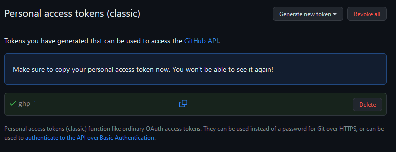
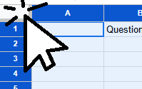
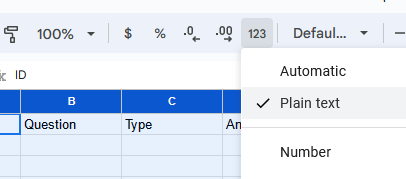
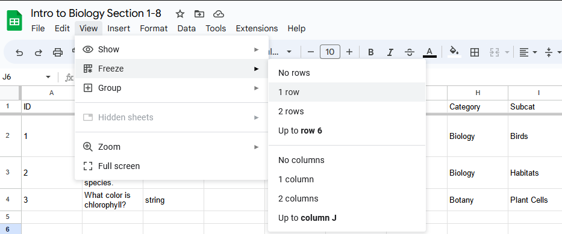
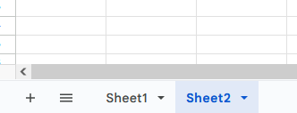
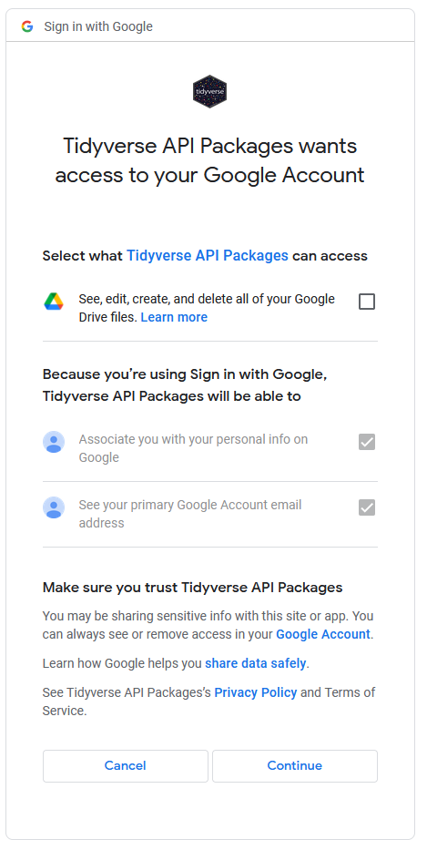
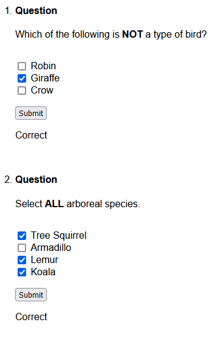

This document should be integrated into `pkgdown` once it is available.

# 1 Install

While `rexamsll` is in development, the most recently pushed version can
be installed through GitHub using the devtools library.

``` r
install.packages("devtools")
```

In order to gain access to this package’s source code, you’ll need a
GitHub account and permission from a project administrator to access the
repository. If haven’t worked with git before, check out
<https://docs.github.com/en/get-started/getting-started-with-git>.

Once you have a git account, you need to create an authentication token
so R can access your repositories. This just means signing in once to
get a special password from GitHub that R can use from then on.

To start, input your GitHub username and the email associated with your
account in their respective strings below, and run the code cell.

``` r
usethis::use_git_config(user.name = "<USERNAME>",
                        user.email = "<YOUR>@<EMAIL>.com")
usethis::create_github_token()
```

This should open your browser and ask you to sign into GitHub before
bringing you to a page titled “New personal access token”.

Start by providing a reason for this token’s creation in the “Note”
section. You can also change the expiration date on the token, though
the default value of 30 days works perfectly well.


You should not need to change any of the selections in the “Select
scopes” section. The “repo” section that is enabled by default should be
all that you need to give R access to.


Now, click the green “Create Token” at the bottom of the page. You
should be presented with a page that looks like the following, with some
code that starts with `ghp_`. (Note that the code has been censored in
this example image.)



Copy this code and, optionally, save it somewhere secure to use later.
Paste it over the text that says `<AUTH CODE HERE>` in the chunk below.
Be sure to delete the `<` and `>`; only your authentication code should
be within the quotes. Then run the code chunk to install rexamsll.

``` r
library(devtools)
install_github("examLing/rexamsll", ref = "main",
               auth_token = "<AUTH CODE HERE>")
```

To check that rexamsll was installed properly, run the following code
chunk and make sure there are no errors.

``` r
library(rexamsll)
```

# 2 Generate `.Rmd` Files from Google Sheets

`rexamsll` allows you to conveniently write your test questions in a
Google Sheets document and then import them into `.Rmd` files for use
with the `exams` package.

## 2.1 Build the Sheet

Create a new Google Sheets document, and fill row 1 with the following
headers:

-   `ID`
-   `Question`
-   `Type`
-   `Image`
-   `Ans1`, `Ans2`, `Ans3`…\*
-   `Correct`
-   `Category`
-   `SubCat`


\* You may use any number of `Ans` columns. Simply label them
accordingly.

**Before adding any more text**, click the light gray box in the top
right corner to select the entire spreadsheet.



Then, set the entire Sheet to plain text. To do this, Press the button
that says “123” (to the left of the font-selection box) and choose
“Plain Text”.



Doing this ensures that any numbers you input will be saved exactly as
you write them.

To add a question, start by putting a unique identifier in the `ID`
column. If multiple rows have the same identifier, they will be
associated with each other (See [Design Dynamic Questions](#section3)).

Then, write the main body text of the question in the `Question` column.
`rexamsll` uses
[R-markdown](https://r02pro.github.io/rmd-text-formating.html) to format
text, so you can, for example, **bold** text by typing “\*\*” on each
side.


The `Type` column dictates what kind of answer is expected for this
question. There are three main choices:

1.  **schoice** - There is a single correct answer, and all other
    options are wrong.
2.  **mchoice** - There is any number of correct answers, and the
    student is graded on how many of these select without choosing
    incorrect answers.
3.  **string** - There are no provided answers and the student is
    instead given an area to input text. The student’s response must
    *exactly* match the correct answer to receive credit.

If the `Type` is **NOT** “string”, provide all of the answers that the
student will need to choose from in the columns starting with `Ans`,
including both correct and incorrect options. You *do not* need to use
all `Ans` columns.


The `Correct` column is used differently depending on the `Type`.

For **schoice** questions, the `Correct` value should be the *index*
corresponding to the correct answer. In the example provided, the
correct answer is “Giraffe”, which is under the column `Ans3`.
Therefore, the `Correct` column should say “3”.

For **mchoice** questions, the `Correct` value should be a
comma-separated list of all correct indices. For example, if the correct
answers lie in the columns `Ans1` and `Ans3`, this cell should say “1,
3”.

For **string** questions, the `Correct` value should be the exact
correct answer. For example, if the question is “What color is
chlorophyll?”, this cell should say “green”.


The `Category` and `SubCat` columns are used for organization and naming
files. Their values should be short, informative names that will help
you keep track of topics. Questions with the same `Category` values
should appear on the same tests.


Now, add another row for every question you want to generate a `.Rmd`
file for.


Give your Sheet a title and, optionally, click “View” -\> “Freeze” -\>
“1 row” to keep the header row visible while scrolling.



## 2.2 Import into R

Start by loading in the `rexamsll` package.

``` r
library(rexamsll)
```

Use `setwd` to place your [working
directory](https://support.posit.co/hc/en-us/articles/200711843-Working-Directories-and-Workspaces-in-the-RStudio-IDE)
where you want the folder of .Rmd files to be saved.

Then navigate back to the spreadsheet containing your questions and copy
the *entire* URL (“<https://docs.google.com/spreadsheets/d/>…”).

Paste the URL into the first argument `url` of the rexamsll function
`google2rmd`. Set the second argument `output_dir` to the folder you
want to store the resulting .Rmd files in.

``` r
google2rmd(
   "<URL>",
   "Example"
)
```

If you are loading questions from a sheet of the spreadsheet *other than
the first*, you’ll need to specify the index of that sheet in
`google2rmd`. For example, if you’re on “Sheet2”, include `sheet = 2`.



``` r
google2rmd(
   "<URL>",
   "Example",
   sheet = 2
)
```

NOTE: This index depends on the *order* of the sheets, not their names.
In the following screenshot, “Sheet3” has been placed before “Sheet2”.
Here, “Sheet3” would have index `2`, and “Sheet2” would have index `3`.


Once you run the function, you should be asked to grant access to your
Google account. You should select “Send me to the browser for a new auth
process.” in the R terminal. Even if “pre-authorized accounts” are
available, they aren’t very reliable, so stick to logging in each time
you start a fresh R session.

When sent to the browser, select the account that your spreadsheet is
stored under and sign in. You should be presented with the following
screen.



Check the box labeled “See, edit, create, and delete all of your Google
Drive files.” and press the “Continue” button.

And the process is done! Assuming there are no issues with your
spreadsheet, R will load the proper Google Sheets document and save all
of the .Rmd files under the correct folder. `rexamsll` also creates a
log file that details the import process, which can be found in the
`logs/log` folder with the name `{DATE}_{TIME}.log`.

If there *is* an error, you’ll also see a file called
`{DATE}_{TIME}.msg` in this folder.

## 2.3 Extra Columns

While [Section 2.1](#section2_1) demonstrates which columns are
*required* to import questions, they are not the only columns that are
*allowed*.

Any extra columns that do *not* match one of names below will be added
to the question’s metadata. This makes it easy to record searchable
tags, warnings, or credits.

As of 23 May, 2023, these extra metadata tags appear in the YAML header
for each respective .Rmd file. Later, these will be added to the
`exams`-specific “Meta-information” footer.

### Image

The “Image” column deserves its own section. See [Adding
Images](#section2_4).

### NChoices

**WARNING: As of 23 May, 2023, this feature only works for dynamic
questions.**

For some **schoice** and **mchoice** questions, you may have more
options to choose from that you would want to appear on the test. For
example, if the question is “Which letter is a vowel?”, the choices
could be any of the 26 letters of the English alphabet.

In this case, you can add a column titled “NChoices” and use it to
specify how many options should be given on tests. For **schoice**
questions, it is guaranteed that one of the options is the correct
answer.




### NCorrect

Todo

## 2.4 Adding Images

Todo

# 3 Design Dynamic Questions

Todo

# A1 Spreadsheet Validation

When importing questions from a spreadsheet, like one created in Google
Sheets or Excel, `rexamsll` goes through a list of checks to validate
the sheet. If any check fails, your function will throw an error.

## “Dataframe has no values.”

**Example:**

    Error in rexamsll:::validate_df(df) : 
      Dataframe has no values. Did you select the wrong sheet?

This error occurs when you try to import data from a spreadsheet that
with only a header. Double check that you pasted the correct url and
that you selected the proper sheet index.

Also, it’s good to note that images don’t count as cell values.

## “Error in if (nrow(df) == 0)…”

**Example:**

    Error in if (nrow(df) == 0) stop("Dataframe has no values. Did you select the wrong sheet?") : 
      argument is of length zero
    In addition: Warning message:
    No data found on worksheet.

This error occurs when you try to import data from a spreadsheet with
*no* values (not even a header). Since there is no data in the sheet, R
fails to load it at all.

Double check that you’re importing from the correct URL and sheet.

## “Missing columns: …”

**Example:**

    Error in rexamsll:::validate_df(df) : Missing columns: type


Your header is missing at least one of the required columns:

-   Question
-   Type
-   Correct
-   Category
-   Subcat

Add the listed headers to the first row of your sheet, and check [Build
the Sheet](#section2_1) to learn how to use each of these columns.

Side note: Interestingly, these headers don’t need to be on the first
row; they just need to be the first *non-empty* row of the sheet. You
can have as many *empty* rows above them as you’d like.

## “No answer columns found”

**Example:**

    Error in rexamsll:::validate_df(df) : No answer columns found


`rexamsll` requires at least ONE column of the format “Ans#” in the
sheet, or it will throw this error.

At the moment, `rexamsll` throws this error even if all questions are of
the **string** type, meaning the columns are empty. In this case, just
add a single “Ans1” column and leave it blank.

## “No values in answer columns.”

**Example:**

    Error in which(na_rows & !sr_rows) %>% paste0(collapse = ", ") %>% sprintf(msg,  : 
      Row 1 has no values in answer columns.


This error is thrown when a **schoice** or **mchoice** question has no
answers to choose from. To fix this, *either*:

1.  Add answers to this row.
2.  Set the “Type” to **string**.
